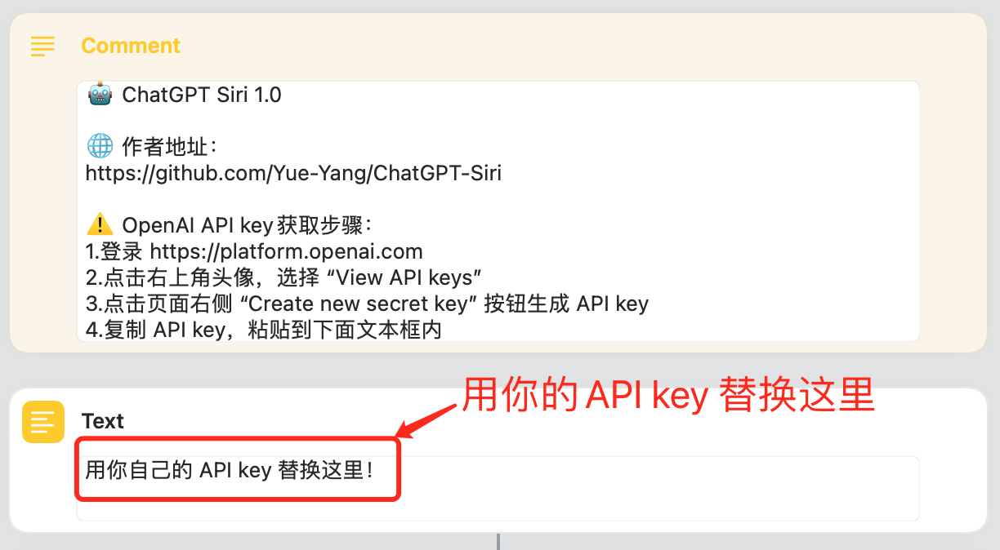
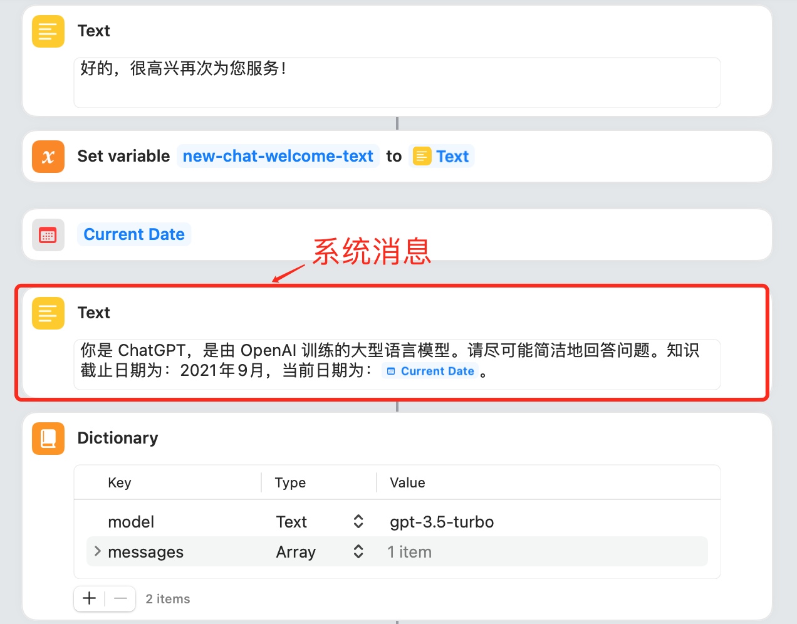

# 🤖️ ChatGPT Siri

通过 Siri 启动「快捷指令」连接 ChatGPT API，让 Siri 变身 AI 聊天助手。你可以直接和 Siri 说出你的问题，Siri 会回答你。现在我们的 Siri 终于变得智能了，可以和我们对答如流！而这一切只需要一个快捷指令和 API key 就可以做到了。

# 快捷指令下载

点击下面链接下载快捷指令

## 智能聊天 1.0

- [简体中文版](https://www.icloud.com/shortcuts/620e11d10bc4419497c0fd323e3fe8f1)
- [English Version](https://www.icloud.com/shortcuts/4535286f97384f839439a865faacb9d2)

## 智能聊天 1.1 （推荐安装1.2版本保存到文件更方便）

新功能：支持自动保存聊天记录到「备忘录」app

- [简体中文版](https://www.icloud.com/shortcuts/b7c3c9939c2c43598caa1efcb3dad954)
- [English Version](https://www.icloud.com/shortcuts/e288497f0de742fdb076195afd3bef86)

## 智能聊天 1.2

新功能：自动保存聊天数据到 txt 文件中，记录包含每次对话的发送和接收时间、tokens 消耗统计，打开「文件」app，找到：iCloud 云盘/Shortcuts/ChatGPT-log 目录即可查看，支持 iCloud 同步。

- [简体中文版](https://www.icloud.com/shortcuts/00838176f7f342008d5a921e8450a98d)
- [English Version](https://www.icloud.com/shortcuts/dfa38b2abb58470380086dc4b5d50143)

# 微信群交流

# API key 获取

使用「快捷指令」调用 ChatGPT API，必须要有 OpenAI API key。你可以到 OpenAI 官网免费获取，步骤如下：

1. 到 https://platform.openai.com 注册账号并登陆
2. 点击右上角头像，选择 “View API keys”
3. 点击页面右侧 “Create new secret key” 按钮生成 API key
4. 复制 API key，备用。注意 API key 只出现一次。忘了只能重新生成一个新的

> 注意：使用 API 需要付费，价格为 $0.0020 / 1K tokens，1k tokens 大约等于 750 个单词，或者 500 个汉字。OpenAI 新用户在头三个月会有 $5 美元免费额度供使用。因此最好不要把 API key 和其他人共享，如果 API key 泄露，可以到 OpenAI 后台删掉，重新生成一个新的。

# 编辑「快捷指令」替换 API key

打开「快捷指令」app，找到下载的「智能聊天」快捷指令，长按选择「编辑」，将上面的 API key 粘贴到下面文本框中。

> 注意：国内已经不能访问 api 了，需要开代理！查看「连接问题」「找不到key」：https://github.com/Yue-Yang/ChatGPT-Siri/issues/1

# 使用方法

用 Siri 启动「快捷指令」，直接说 “嘿，Siri，智能聊天”，然后就可以开始和 Siri 聊天了，我们的 Siri 变得非常智能，enjoy！🎉

如果你不喜欢这个名字，你可以长按选择重新命名，改成任意你喜欢的名字，然后用 Siri 唤醒就直接说 “嘿，Siri，xxx”，xxx 是你修改的名字，最好不要加特殊符号什么的，不好念😂，识别匹配不了就启动不了！

你当然也可以直接点击使用「快捷指令」，这个时候是以对话框的形式使用，不会读出来，添加到主屏幕更方便点击使用。完结🎉

# 进阶用法

本快捷指令支持 iPhone、iPad 和 Mac，支持连续对话，支持退出聊天，新聊天。用法如下：

- 默认就是支持连续对话，可以记录上下文，可以连续讨论问题
- 如果你想开启新聊天，在我们输入时说 “新聊天”，Siri 会开启新一轮聊天，这意味着前面的上下文将丢失，不能接着前面的信息继续聊
- 如果想退出智能聊天以使用系统的 Siri，你可以在自己轮，说 “退出聊天”。当然你也可以直接关闭 Siri，重新在打开。但这里提供命令退出，更自然

## 自定义系统消息

你也可以自定义系统消息，系统消息有助于设置助手的行为。在本「快捷指令」系统消息是使用的 ChatGPT 的默认系统消息之一：

> 你是 ChatGPT，是由 OpenAI 训练的大型语言模型。请尽可能简洁地回答问题。知识截止日期为：2021年9月，当前日期为：Current Date。

修改方法，编辑「快捷指令」，往下滑，找到如图所示位置：

比如，你可以用下面的内容替换系统消息：

> 下面我让你来充当翻译家，你的目标是把任何语言翻译成中文，请翻译时不要带翻译腔，而是要翻译得自然、流畅和地道，使用优美和高雅的表达方式。

当然你也可以自己写，比如让他做段子手、当作家、当厨师等等，有无穷的玩法。你也可以到网络上找别人写的 Prompt，稍加修改填入这里。这里建议分别复制一份「快捷指令」，然后起一个名字，比如当翻译的快捷指令就叫「翻译家」，这样你直接说 “嘿，Siri，翻译家”，就启动一个专门翻译的 ChatGPT 了。

你当然也可以在通用的那个「快捷指令」里面，在自己轮输入时直接说一遍，让他帮你当翻译。但是不如上面那个专门修改了系统消息为翻译的「快捷指令」更方便，这个「翻译家」直接就可以工作了，非常 nice！这也是 Prompt 的意义，可以先自定义一个场景，然后更高效使用 ChatGPT。所以现在网上各种 Prompt 的教程。我们可以举一反三，让 ChatGPT 更好为我们服务！
